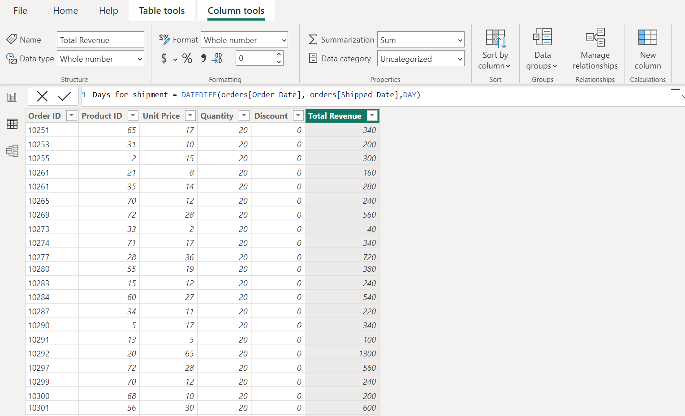
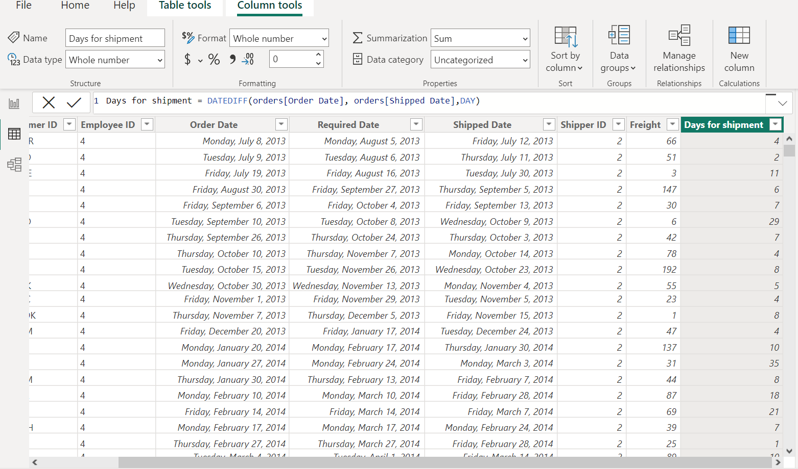
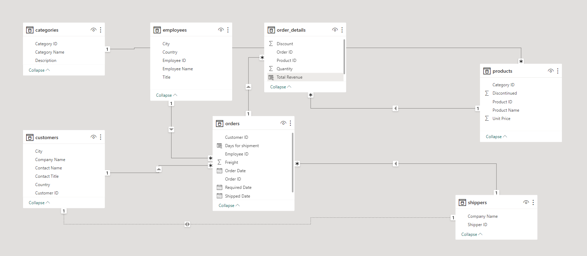
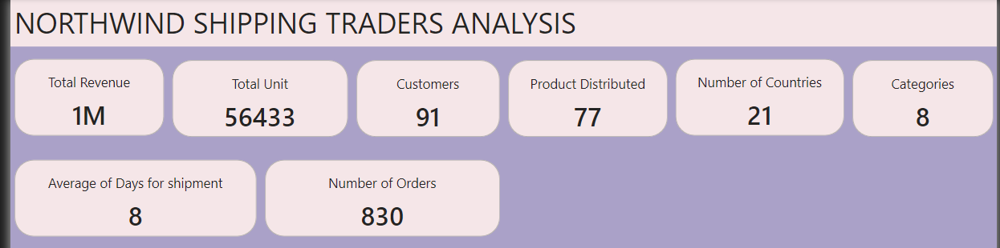
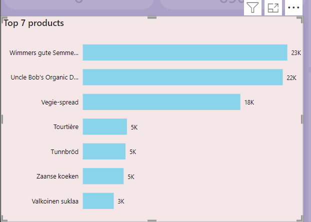
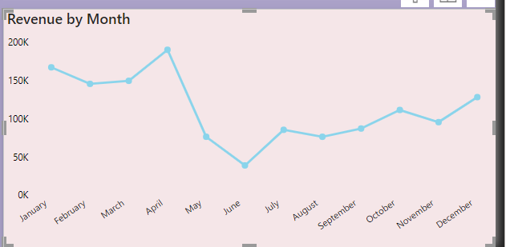
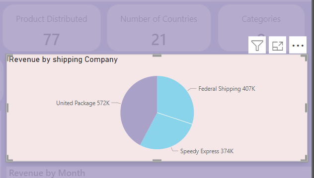
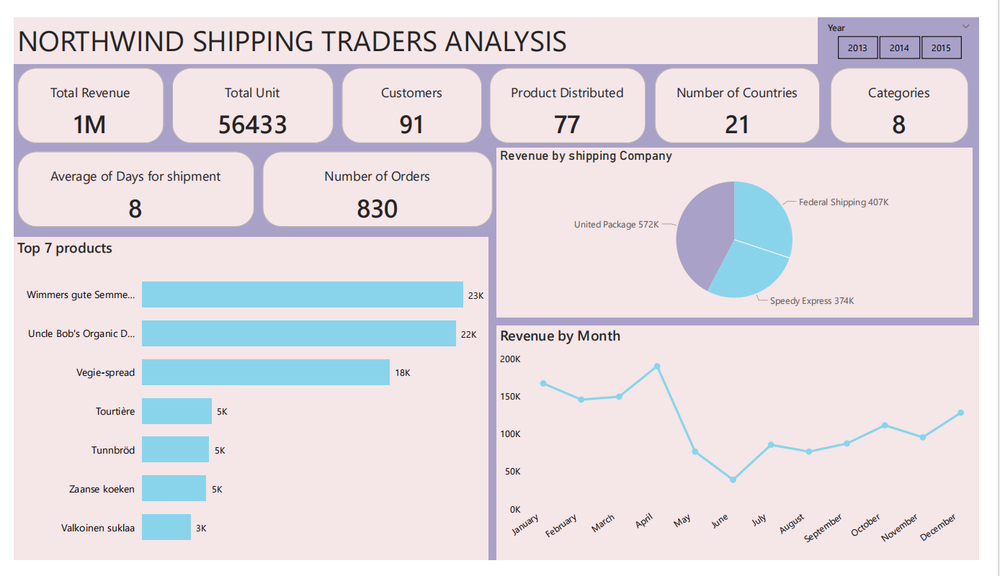

# Northwind-Traders-Shipping-Analysis
Analysis for Northwind Traders, A project analysis to achieve a thorough knowledge of the company's revenue and overall performance.

## INTRODUCTION

The Northwind database is a sample database provided for this project analysis. This analysis provides a detailed in-depth of **Power BI**
dashboard, it contains measures and visuals designed to answer specific questions related to the dataset. The aim is to extract valuable 
information from the datasets by critically analysing each variables. This database exports specialty foods from twenty one countries in the world.
The Northwind database is an excellent schema for a small-business ERP, with customers, orders, inventory, purchasing, suppliers, shipping, and employees.
**_Disclaimer_** All datasets and reports do not represent any company, institution or company, but a dummy dataset to demonstrate the capabilities of Power BI.

## DATASET

The Northwind dataset includes seven distinct sample data files in CSV format, listed below are the following tables.
1. Categories: Category ID and Names
2. Customers: Customers who buy products from Northwind
3. Employees: Employee details of Northwind traders
4. Products: Product information
5. Shippers: The details of the shippers who ship the products from the traders to the end-customers
6. Orders and Order_Details: Sales Order transactions taking place between the customers & the company

## CONCEPT DEMONSTRATED:

The following Power BI features were incoporated:
- Bookmarking
- Dax functions
- Filters
- Modeling
- New columns

 ## DATA CLEANING

Using the Get data Tab, I imported each file using the **Text/CSV** option and loading each based on the entire dataset.
I loaded the files into Power Query editor for cleaning. I Renamed column headings, I checked for missing values, duplicates,
nulls, empty cells and Changed data types for each column.
  
### To ensure the integrity of the data I checked the following;

- Column quality
- Column distribution
- Column profile

The quality, distribution and profile all came back 100% valid, no error and empty cells. Cleaned thoroghly except for the 
"Shipped table" column in the "Order" table which showed twenty one null values, these null values were filled down
( Table.FillDown(#"Replaced Errors",{"Shipped Date"}) to ensure accuracy in the analysis.

Two new columns were also created for the analysis

- Total Revenue (Total Revenue = order_details[Unit Price] * order_details[Quantity].

---

- Average days for shipment orders (Days for shipment = DATEDIFF(orders[Order Date], orders[Shipped Date],DAY).

---

## DATA MODELING

Automatic derived relationships are adjusted to remove and replace unwanted relationships, I created relationships
between various tables. This relationship is essential for connecting data to be able to perform meaningful analysis.

---

## KEY PERFORMANCE INDICATORS (KPIs)

1. Total Revenue: The total revenue generated by Northwind Traders is $1 Million
2. Average Shipping Days: The average days it takes to ship order is 8 days.
3. Total Unit Price: The total unit price for all product categories is 56433.
4. Countries Involved: The total number of countries covered in the dataset is 21.
5. Total Orders from 2013 to 2015: The total number of orders placed by customers is 830.
6. Total Number of Customers: A total of 91 customers.
7. Counts of Products: A total of 77 unique prodcts were distributed.
8. products categories: The number of product categories is 8.
 

---

Exploring the datasets for more insights, here are three questions:

1. What are the Top 7 Products in terms of Revenue?

---

2. Revenue trends monthly?

---

3. Total Revenue generated by each Shipping Company?

---

## DASHBOARD
This dashboard is designed to visually represent each KPIs and analyse each dataset providing an interactive 
way to understand.

## CONCLUSION

This study sought to investigate three questions as they relate best reaching these goals:
What are the Top 7 Products in terms of Revenue?, The monthly trends? and Total Revenue 
generated by each Shipping Company?, It is important to determine whether there is a 
threshold at which a loss of revenue can be justified by the effects being generated.
They can increase the number of shipping company in the hopes of buying more products to generate more revenue.
In doing so, they would also have an opportunity for future analysis of data gathered after the fact 
for before-and-after comparisons.
